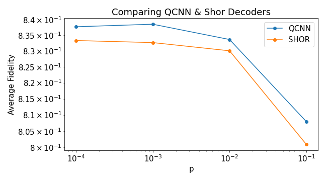

# PeachIceTea

2022 양자정보경진대회 (해커톤)

## Settings

    - TRAINING_SIZE: 10000
    - VALIDATION_SIZE: 1000
    - TEST_SIZE: 1000

## Result
### Comparison ($2^{2^n}=256$ features)
    - 256 features (8 qubits): 0.97
### Arbitrary dimension case (30 features)
  1. Layer-wise qubit padding (add 1-qubit to each layer with odd qubits
     1. 30 features to 5 qubits: 0.974 accuracy
  2. Data padding to match $2^{2^n}=256$ 
     1. 30 feature to 8 qubit - zero data padding : 0.984 accuracy
     2. 30 feature to 8 qubit - periodic data padding: 0.946 accuracy
     3. 128 feature to 8 qubit - zero data padding: 0.965 accuracy
  3. Single ancilla padding (ancilla qubit is added to make all layers even
     1. 30 featues to 5 qubit 0.989 accuracy (for 0 vs 2: 0.9284 accuracy

| Method | Features | Initial Qubits $M$ | Ancillary Qubits | Total Qubits | Accuracy |
|--------|----------|------------|-------------|----------|--------|
| Conventional | 256 | 8 | 0 |8| 97%|
|Layer-wise| 30 | 5 | $\mathcal{O}(\log(M))$=2 |7| 97.4% |
|Single-Ancilla|30|5|1|6|98.9%|
|Zero-Data Padding|30|5|$\mathcal{O}(M)$=3|8|98.4%|
|Periodic-Data Padding|30|5|$\mathcal{O}(M)$=3|8|94.6%|

### QEC for arbitrary code length

- Encoder: Shor's repetition code
- Decoder:
  - QCNN decoder (single-anscila method on 3-qubit code)
  - Shor's decoder

By comparing with various error rates, it turns out that QCNN decoder outperforms Shor's decoder for every error rates.
